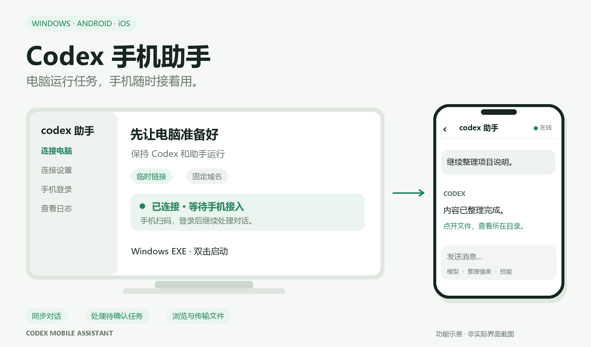
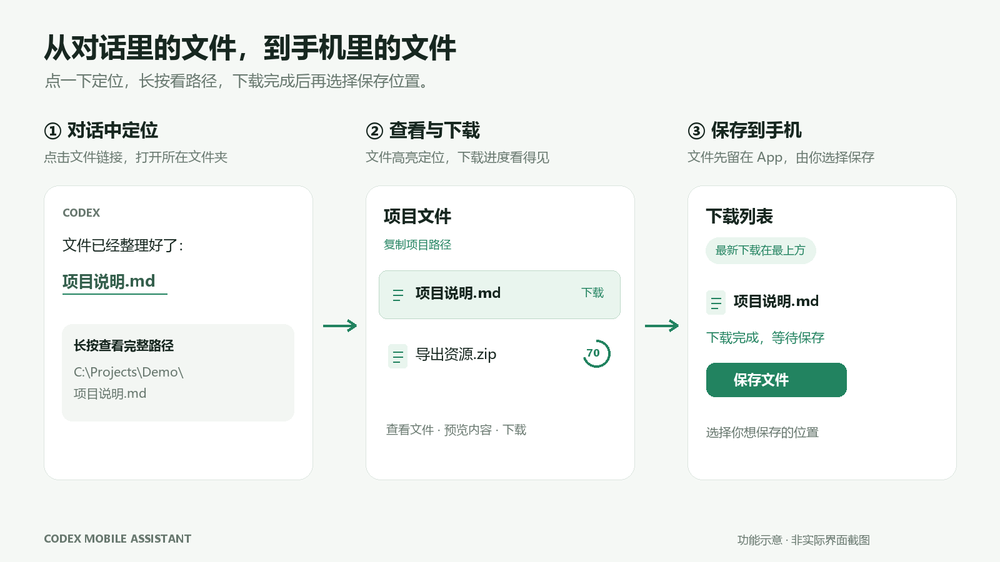

# Codex 手机助手

**电脑运行任务，手机随时接着用。**

电脑上的 Codex 正在干活，临时要出门怎么办？打开手机，就能接着看对话、发消息、处理需要确认的操作，还能把项目文件拿到手机上。

这是一个社区制作的辅助工具，与 OpenAI 无隶属关系。任务仍由电脑上的 Codex 执行。本仓库用于发布安装包、使用说明和功能介绍，当前版本不提供程序源码。

## 下载最新版

电脑端与手机端请配套更新：**Windows 1.6.20 / Android、iOS 1.0.16**。

| 平台 | 版本 | 安装包 |
| --- | --- | --- |
| Windows 10/11 x64 | 1.6.20 | [下载 EXE](https://github.com/Abyxs/codex-mobile-assistant/releases/download/v1.6.20/CodexMobileAssistant-Windows-1.6.20.exe) |
| Android | 1.0.16 | [下载 APK](https://github.com/Abyxs/codex-mobile-assistant/releases/download/v1.6.20/CodexMobileAssistant-Android-1.0.16.apk) |
| iPhone / iPad | 1.0.16 | [下载 IPA](https://github.com/Abyxs/codex-mobile-assistant/releases/download/v1.6.20/CodexMobileAssistant-iOS-1.0.16-unsigned.ipa) |

[本次发布说明](https://github.com/Abyxs/codex-mobile-assistant/releases/tag/v1.6.20) · [文件校验值](https://github.com/Abyxs/codex-mobile-assistant/releases/download/v1.6.20/SHA256SUMS.txt) · [安装与使用](docs/quick-start.md)

EXE 双击启动，无需另外安装 Python。APK 用于 Android 安装。IPA 为未签名包，需要自行签名后安装，不能在 iPhone 上下载后直接点开安装。

## 先从电脑端开始

1. 在电脑上打开 Codex 桌面版，再双击助手 EXE。
2. 选择连接方式：**临时链接**不需要自己的服务器和域名；**固定域名**适合已有服务器、希望入口地址稳定的用户。
3. 在手机 App 首页扫码，输入电脑端显示的手机登录账号和密码。勾选记住登录，后续使用更方便。

电脑、Codex 和助手需要保持运行。临时链接在重新连接后可能改变；固定域名也需要电脑在线。手机浏览器同样可以访问助手链接。

## 手机端主要能做什么

### 接着聊，也能新建对话

查看电脑上的对话，继续发消息、发送图片，选择模型、推理强度和技能。既能在现有项目中继续，也能新建不关联已有项目的临时对话。临时对话会保存历史。

### 任务进度随时看

按项目浏览、搜索和切换对话；“正在工作”集中显示正在执行任务的对话。任务需要回答问题或确认操作时，可以直接在手机上处理。也支持停止任务，以及对话置顶、重命名和归档等管理操作。

### 项目文件，手机也能拿到

- 点击对话中的文件链接，打开所在文件夹并高亮该文件；长按查看完整路径，也能复制。
- 在项目文件页浏览、预览和下载文件，也可以上传文件到电脑项目中。
- 点击下载后显示圆环进度，下载列表中最新任务排在最上方，支持取消下载和删除记录。
- 文件先下载到 App 内，再由你点击“保存文件”选择保存位置。
- 对话中的图片支持点开查看、关闭和双指缩放。

### 日常操作少折腾

手机端保存连接地址，进入时自动尝试连接；首页显示连接状态。电脑端支持最小化到托盘；连接诊断可以直接查看、复制。

## 使用前知道这几件事

- 需要自己可用的 Codex 桌面版和模型服务，本应用不提供账号或模型额度。
- 当前文件传输主要面向电脑本地项目；模型能否处理图片取决于所选模型。
- 关闭下载列表可以继续下载。锁屏、切换到后台或系统结束 App 时，下载和通知仍受手机系统限制，尤其是 iOS。
- 本次三个安装包已完成构建与完整性、版本核对，最新交互尚未做真机验证。
- 配图是自行绘制的功能示意，具体外观以实际版本为准。

[常见问题](docs/faq.md) · [更新说明](docs/releases.md) · [第三方声明](NOTICE.md) · [许可证](LICENSE)
