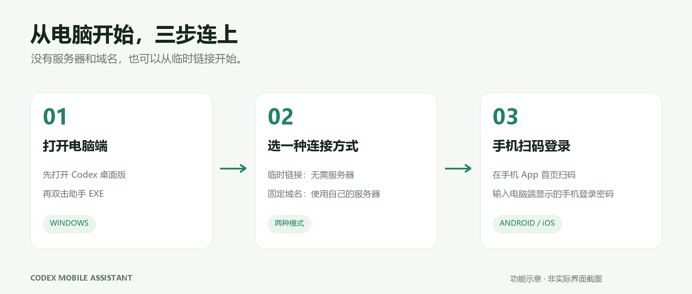

# 安装与使用

## Windows 电脑端

1. 从 [Releases](https://github.com/Abyxs/codex-mobile-assistant/releases/latest) 下载 EXE，放进自己可写的文件夹。
2. 在同一台电脑、同一 Windows 用户下打开 Codex 桌面版，再双击助手。
3. 初次使用可以选临时链接，不需要服务器或域名。等待连接成功后，用手机端扫描二维码。
4. 手机登录密码在电脑端“手机登录”中查看，不是 Codex 密码，也不是 SSH 或宝塔面板密码。

使用自己的固定域名时，请先准备可用的 HTTPS 站点和转发设置，再在电脑助手中填写自己的服务器信息。固定入口并不意味着电脑可以离线。

## Android 手机

下载 APK 并安装，按手机系统提示允许对应来源安装应用。打开 App，在首页点击扫码连接，扫描电脑助手的二维码，输入手机登录账号和密码。

请使用 Android 1.0.24 及配套 Windows 1.6.27。新版 APK 补齐扫码运行依赖；新版 EXE 修复旧版 WebView 无法显示对话列表的问题。

如果系统提示签名不兼容，不要急着卸载；先导出 App 内需要保留的下载文件。卸载可能清除应用内文件和记录。

## iPhone / iPad

本次提供的是未签名 IPA。需要自行签名并通过适合自己的安装方式安装；下载 IPA 文件本身不等于安装完成。安装后在首页扫码连接。

## 查看、下载和保存文件

点击对话文件链接先打开所在文件夹并定位文件，不会直接开始下载；长按链接可以查看和复制完整路径。直接显示的图片仍可点开预览。

在文件页点击下载按钮，查看圆环进度；也可以打开“下载列表”管理任务。下载完成后，苹果端在项目文件列表点击文件名或右侧“用其他应用打开”，即可打开系统分享菜单，选择其他应用或“存储到文件”，不会重复下载。下载列表中也保留相同入口。Android 和网页使用各自的保存方式。删除下载记录可能同时移除 App 内对应文件，请先保存需要保留的内容。

请配套运行新版 EXE，项目文件列表的交互由电脑端提供。

关闭下载列表不会暂停任务；离开 App 时暂停，回来后在下载列表点击“继续下载”。续传依赖电脑端支持，文件已变化或旧任务无法核对时会提示重新下载。

## 发送文件与调整权限

打开电脑本地对话，在输入框添加文件，等待上传完成后发送。支持文档、表格、代码、压缩包等，也支持粘贴和拖入；每条消息最多 4 个附件（含图片），普通文件单个最大 20 MB。SSH 对话目前只支持图片附件。

输入框下方点击“权限”，可以选择与 Codex 原生对应的“请求批准”“帮我批准”或“完全访问权限”，回读一致后才提示同步成功。选择仅作用于当前对话的下一轮，不会自动处理已经弹出的确认请求。

确认卡片先显示操作说明；需要查看完整命令、目录或权限时，展开“详情”，也可以复制详情。

## 更新

先保存需要保留的应用内文件，再安装新手机包。电脑端关闭旧助手、运行新 EXE；网页及文件功能由电脑端提供，仅更新手机包不会替换旧电脑端界面。

不要把 EXE 同目录下的 `app/.local` 发给别人，其中包含你的连接设置和运行数据。
